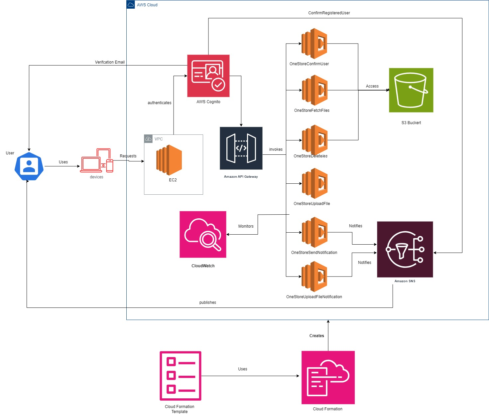

# OneStore

**onestore** is a web-based cloud storage application that allows users to securely upload and manage files. Built using AWS services, onestore provides a simple and reliable solution for personal file storage needs.

## Features

-   **User Authentication**: Secure user sign-up and login using AWS Cognito.
-   **File Upload and Storage**: Upload files to the cloud with easy access and management.
-   **File Management**: View, download, and delete files directly from the web interface.
-   **Notification Service**: Real-time notifications for user registration and file uploads  via Amazon SNS.
-   **Scalable Infrastructure**: The application scales automatically based on demand using AWS Lambda, API Gateway, and S3.

## Usage

-   **Sign Up / Login**: Create a new account or log in with existing credentials.
-   **Upload Files**: Navigate to the file upload section and upload your files to the cloud.
-   **Manage Files**: Download, or delete your files from the cloud.
-   **Receive Notifications**: Get notified instantly when your file activities occur.


## Architecture Overview

onestore leverages the following AWS services:

-   **Amazon S3**: Stores files securely with different folders for each user.
-   **AWS Lambda**: Backend logic for handling file uploads, retrievals, and deletions.
-   **Amazon API Gateway**: Provides a RESTful API interface to interact with the Lambda functions.
-   **AWS Cognito**: Manages user authentication and authorization.
-   **Amazon EC2**: Hosts the frontend of the application.
-   **Amazon SNS**: Sends notifications to users about their file activities.


### Diagram : 




## Infrastructure as Code (IaC) with AWS CloudFormation

### What is AWS CloudFormation?

AWS CloudFormation is a service that allows you to define and manage AWS infrastructure as code. By writing templates in JSON or YAML, we can automate the provisioning and configuration of our AWS resources, ensuring consistent and repeatable deployments.


### How OneStore Uses AWS CloudFormation

In the OneStore project, AWS CloudFormation was used to provision and manage all the necessary AWS resources required for the application.  By using AWS CloudFormation, the entire infrastructure can be provisioned with a single template, making it easy to deploy, update, and manage the resources.

### Benefits of Using AWS CloudFormation

-   **Automation**: The entire infrastructure is defined in code, which automates the deployment process.
-   **Consistency**: Ensures that all environments (development, staging, production) have identical setups.
-   **Version Control**: The CloudFormation template can be stored in a version control system (like GitHub), enabling tracking of changes and easy rollback if needed.
-   **Scalability**: Makes it easier to scale the application by modifying the CloudFormation template and redeploying it.

### CloudFormation Template Structure

The CloudFormation template used for OneStore is structured as follows:

-   **Resources Section**: Defines all the AWS resources (S3 buckets, Lambda functions, EC2 instances, etc.).
-   **Outputs Section**: Provides the necessary information (like S3 bucket names, Lambda ARNs) after the stack is created.


Using AWS CloudFormation in the OneStore project ensured that the infrastructure was deployed efficiently and consistently. It allowed the team to focus on developing the application rather than manually configuring and managing cloud resources.


For the complete CloudFormation template used in this project, [click here](CloudFormation.yaml).


# Getting Started


### Prerequisites

Before you can run the OneStore application, ensure you have the following installed on your local machine:

-   Docker: Make sure Docker is installed and running.
-   DockerHub: Make sure to have dockerhub account and a repository setup.

### Building the Docker Image Locally

#### Dockerfile

```
# Use Node.js 20 image as the base image
FROM node:20-slim as build

# Set the working directory in the container
WORKDIR /app

# Copy package.json and package-lock.json
COPY package*.json ./

# Install dependencies
RUN npm install

# Copy the rest of the application code
COPY . .

# Expose port 80
EXPOSE 80

CMD ["npm", "start"]

```

If you want to build the Docker image locally from the provided Dockerfile, follow these steps in the terminal:

**Make sure you are logged in to docker**

```
docker login
```

**Build the docker Image:**

Navigate to the `frontend` directory and build the Docker image:
```
docker build -t DOCKERHUB_USERNAME/REPO_NAME:v6 .
```

**Push the docker Image to DockerHub:**

Once the image is built successfully, push the image to the dockerhub with following command:

```
docker push <your-dockerhub-username> onestore:v6
```

Then continue to deploy the stack by making changes to the cloudformation script and updating the docker image name and username. After this, continue to the next step, that is **"Deploying the Stack"**.

**If not making any changes to this project, one can simply run the application by following the below steps:**

* Download the **CloudFormation.yaml** file from the repository.
* Next, follow the below mentioned steps.


## Deploying the Stack

To deploy the OneStore infrastructure using CloudFormation, follow these steps:

1. **Upload the Template**: Navigate to the AWS CloudFormation console, select 'Create Stack', and upload the template file [**CloudFormation.yaml**].
2. **Specify Parameters**: Fill in the optional parameters such as the API Deploy Stage Name.
3. **Review and Deploy**: Review the resources that will be created, and then click 'Create Stack' to deploy.

4. Upon successful deployment, you will receive outputs such as the EC2 instance IP address, where the application will be deployed.

5. Navigate to a web browser, and enter the following URL in the search bar:
```
http://<IP Address from the Stack Output>:3000
```
or Simply copy the value of the Output with name **"CloudInstancePublicIP"**


That's it !!. The application is up and running, without the need to setup anything. 


A complete Project Report with in-depth details can be found, [click here](docs/Luv_Patel_B00950942_Project_Report.pdf).

