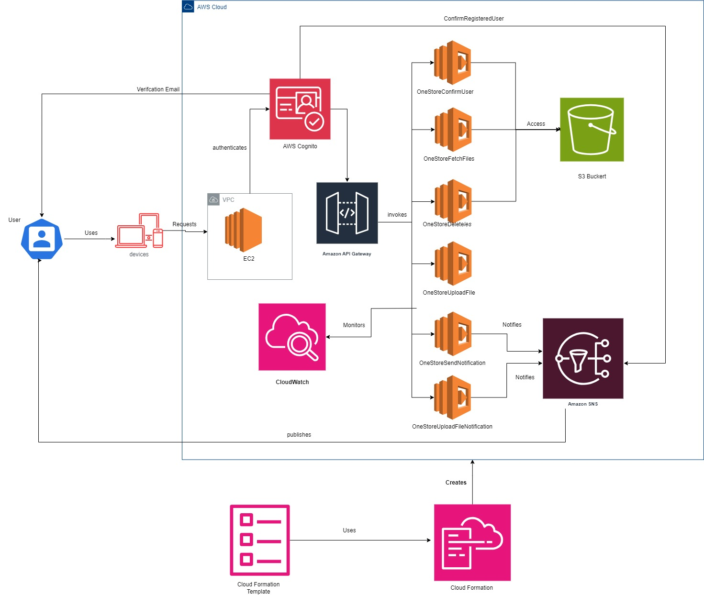

## OneStore

**onestore** is a web-based cloud storage application that allows users to securely upload and manage files. Built using AWS services, onestore provides a simple and reliable solution for personal file storage needs.

## Features

-   **User Authentication**: Secure user sign-up and login using AWS Cognito.
-   **File Upload and Storage**: Upload files to the cloud with easy access and management.
-   **File Management**: View, download, and delete files directly from the web interface.
-   **Notification Service**: Real-time notifications for user registration and file uploads  via Amazon SNS.
-   **Scalable Infrastructure**: The application scales automatically based on demand using AWS Lambda, API Gateway, and S3.

## Usage

-   **Sign Up / Login**: Create a new account or log in with existing credentials.
-   **Upload Files**: Navigate to the file upload section and upload your files to the cloud.
-   **Manage Files**: Download, or delete your files from the cloud.
-   **Receive Notifications**: Get notified instantly when your file activities occur.

## Architecture Overview

onestore leverages the following AWS services:

-   **Amazon S3**: Stores files securely with different folders for each user.
-   **AWS Lambda**: Backend logic for handling file uploads, retrievals, and deletions.
-   **Amazon API Gateway**: Provides a RESTful API interface to interact with the Lambda functions.
-   **AWS Cognito**: Manages user authentication and authorization.
-   **Amazon EC2**: Hosts the frontend of the application.
-   **Amazon SNS**: Sends notifications to users about their file activities.

